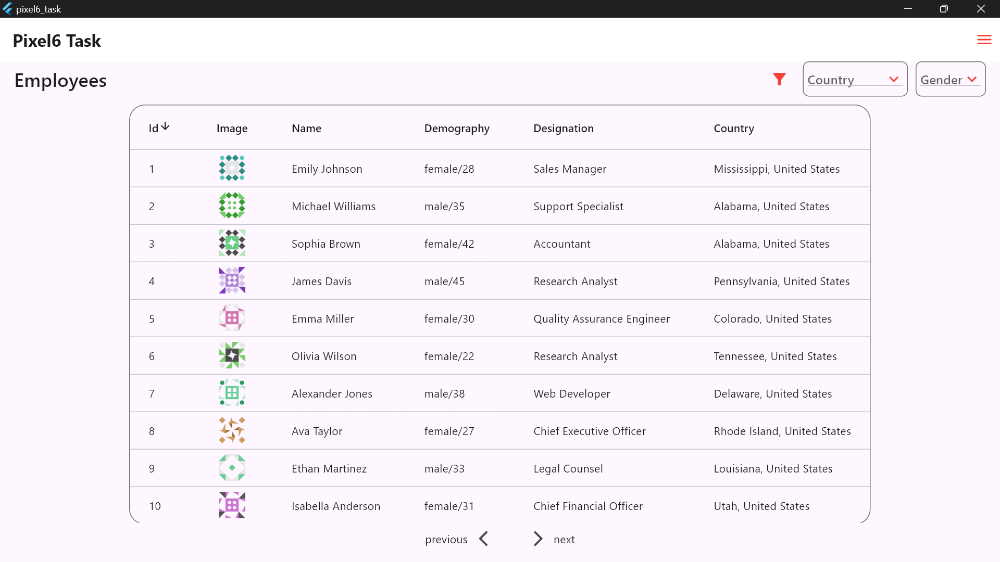

## Overview

Employee Data Viewer is a Flutter application that fetches employee data from an API and displays it in a list. The app also provides filtering options for users to filter the displayed employee data based on various criteria.

## Features

- Fetches employee data from an API.
- Displays employee data in a list view.
- Provides filtering options to refine the displayed employee data.
- User-friendly interface with smooth navigation and interaction.

## Installation

## Usage

1. **Fetching Data:**
   - On launching the app, it will automatically fetch employee data from the configured API endpoint.

2. **Viewing Data:**
   - The main screen displays a list of employees with their basic details.

3. **Filtering Data:**
   - Use the filter options provided to refine the list based on criteria such as department, role, or any other attribute.

## Project Interface

## Dependencies

- [http](https://pub.dev/packages/http): For making HTTP requests to fetch data from the API.
